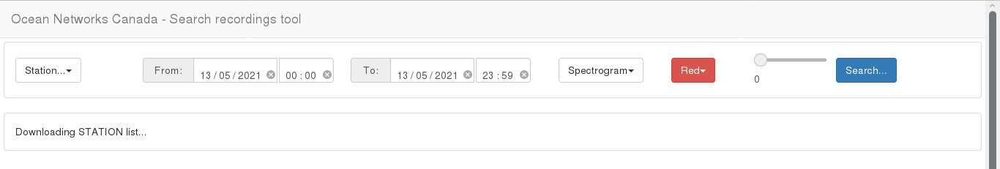
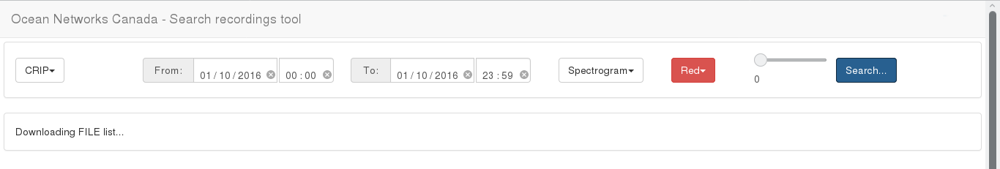
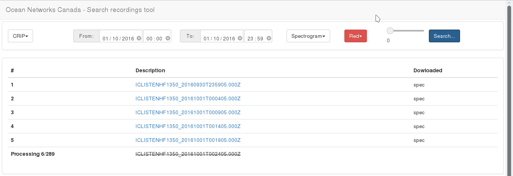
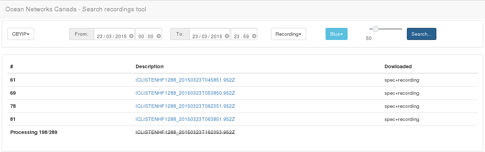
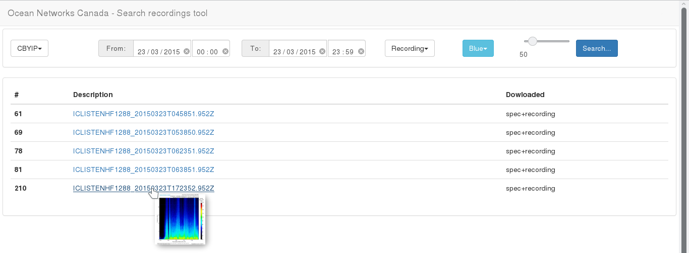
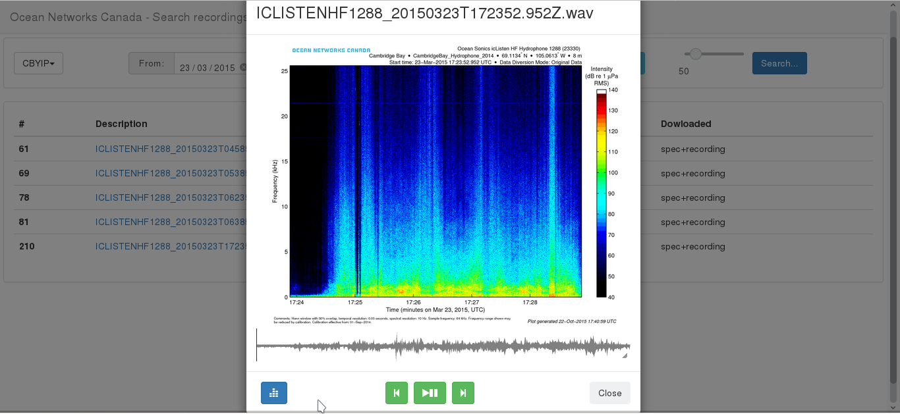

#

This tool is a simple interface to search/download files from [Ocean Networks](https://www.oceannetworks.ca/).
We are using its API, but currently owners made available a second version of the [API](https://wiki.oceannetworks.ca/display/O2A/Oceans+2.0+API+Home)

## Getting Started

Install some web server (such as apache, nginx, etc.) and put the files inside the directory structure.
In some servers, such as apache, you should edit the configuration file to allow scripts to have more time to response (e.g., max_execution_time and max_input_time in php.ini).

## How does it work?

When the page is ready, the sation list is loaded.
The user can selection some station in the left list, define a period, inform which data to download (spectrogram or recording+spectogram) and define a filter.
That filter is applied to spectrograms when one select the *Recording* option to reduce the data amount downloaded and improve time consuming.

When selecting a color channel (red, blue, or green), each pixel value will be mapped to

```math
2\times ch_{selected} - remain_{ch1} - remain_{ch2}.
```

An example is when one selects green color

```math
2\times green - red - blue.
```

That resulted value is compared with a threshold (value between 0 and 255) selected and if the value is less than the threshold then the pixel will be set to black.
At the end, if more than 50\% of the spectrogram pixels are not black then the recording will be downloaded.

After clicking in the search button, the system downloads a file list and starts to download each file in the list.
The progress is presented in the grid and can take much time to finish.

## Directory structure

Files will be downloaed inside *data/img* and *data/record* directories. 

> obs.: Browsers such as Firefox and Google Chrome can play only audios in PCM at 8 or 16 bits per sample.

## Data presentation

When a user clicks on a table links, the recording is presented in a player with basic functions (forward, play/pause, backward) and equalizer controls. 
Besides, mouse hover on audio track shows time,
a mouse click can forward, and backward. 
Track can not fit in spectrogram image width, depending on the dimensions of the image.
To dial with it, the audio track can be resized and repositioned with mouse click and drag;

> obs.: Browsers such as Firefox and Google Chrome can play only audios in PCM at 8 or 16 bits per sample.

## Some examples

Initial testes can be with: station CBYIP between 23/03/2015 00:00:00 and 23:59:59; or station CRIP between 01/10/2016 00:00:00 and 23:59:59

## Screenshots

### Loading station and file lists





### Downloading spectrograms and recordings





### List visualization




